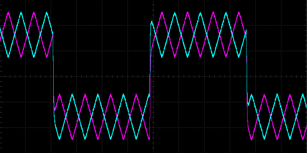
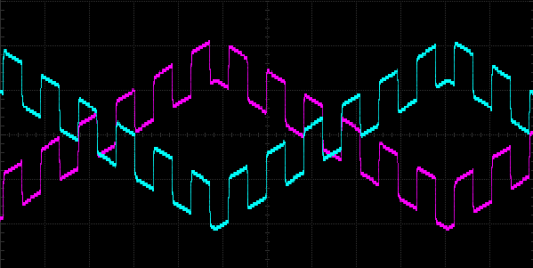

# STM32L031 Dual Low Frequency Oscillator

---

### Features:

- Rate and Depth controls per LFO, all ranging from 0v to +3.3v:
- LFO A has TRIANGLE, SQUARE, and SAMPLE & HOLD waveforms
- LFO B is always TRIANGLE wave
- LFO A can be switched to FAST mode, which pushes the frequency into the audio range for scifi FX

---

### LFO Modes:

A 3-position rotary switch determines how LFO A and LFO B work together.

#### NORM Mode
LFO A and LFO B are completely independent. Below is one example setting, with LFO A in blue set relatively slow and LFO B at a faster rate in purple.

#### SYNC TO A Mode
Forces both A and B sides to use only the output of LFO A. The B side may be inverted relative to the A side. 

This mode is good for straightforward stereo panning effects. The RATE B control has no effect in this mode.

#### ADD Mode
The most complex. The contributions of LFO A and LFO B are summed together.

In this mode the DEPTH A knob controls how much of LFO A is applied to both filter A and filter B. Likewise the DEPTH B knob controls how much of LFO B is applied to both filters.

The INVERT B switch inverts the contribution of LFO B going to filter B.

This allows us to create a variety of complex modulation schemes like shown below. In all images the contribution going to filter A is shown in blue and filter B modulation is purple.

---

### Prerequisites for building and flashing the project:
- [arm-none-eabi toolchain](https://developer.arm.com/tools-and-software/open-source-software/developer-tools/gnu-toolchain/gnu-rm/downloads)
- [GNU make](https://www.gnu.org/software/make/)
- [st-link utility](https://www.st.com/en/development-tools/stsw-link004.html)
- A physical st-link device. I use an old [Nucleo board](https://www.st.com/en/evaluation-tools/stm32-nucleo-boards.html).
- If you have a different preferred method of flashing STM32 chips (openocd, etc) then feel free to go wild.

### To build the project:
- `$ make`

### To flash an STM32 chip connected to an st-link programmer via the SWD header:
- `$ make write`

---

### Firmware directory organization:
- `third_party` contains the STM32 supplied CMSIS header-only files, assembly startup routine, and linker script.
- `BSP` is a very basic "Board Support Package", this module initializes and modifies the various stm32 peripherals used by the system.
- `lib` contains user library files.
- `src` contains the main application files.
- `utils` contains non-c language utility source files such as a python lookup table generating script.
- `bin` is the destination for output files generated by the build process.
